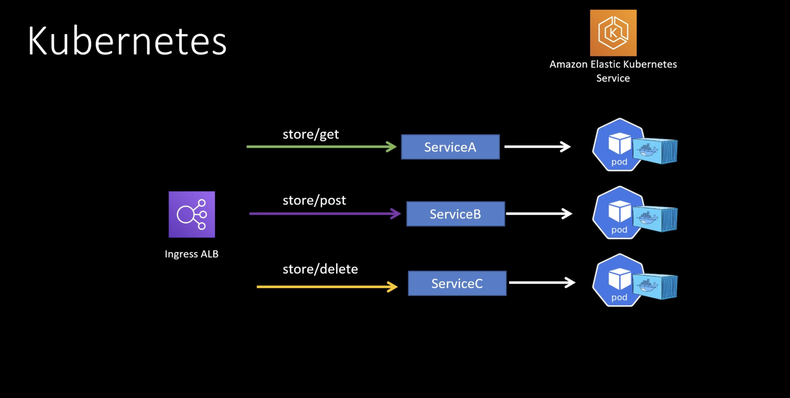

## AWS Microservices

### AWS Microservice

#### ASG Alternative
* Each microservice is running within its on EC2
  * Each EC2 is part of an ASG, with its own scaling criteria
* ELB and AP Gateway can be used to host those microservices

#### Serverless Alternative
* Each of the backend functions can be stored into Lambda functions 
* Lambda scales automatically (no ASG in this case)
* Lambda can be fronted by an ELB, or API GW.

#### ECS / EKS Alternative
**EKS Example** 
* Each microservice is fronted by different services
  * Code for each microservice is run in a **container**
  * Container is run inside a **pod**
* Each API call can be hosted with separate services

